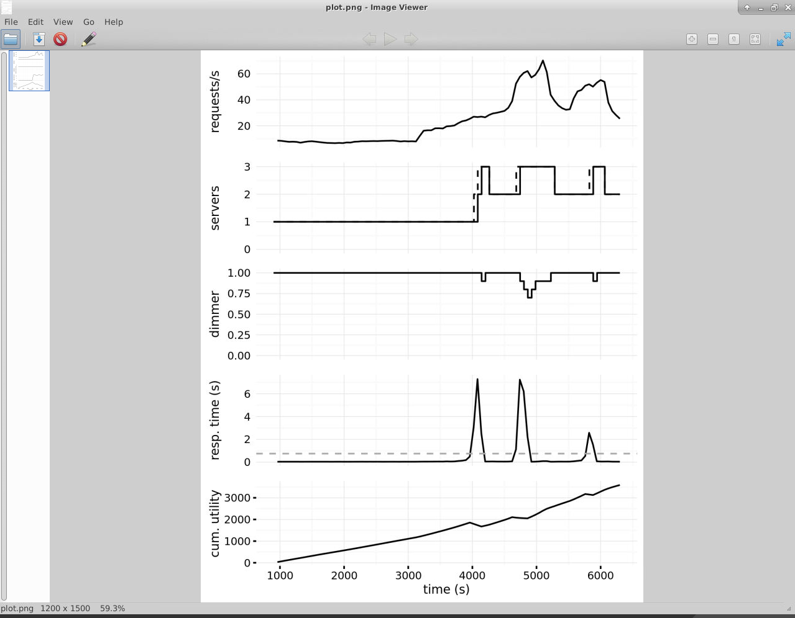

# External_Adaptation_Manager
An external adaption manager built in python for the SWIM framework of self adaptive learning. The current adaptation manager uses TCP communication to work with the SWIM docker container and simulate a network traffic of roughly 1 hours 45 minutes. The load balancer uses a simple approach for load balancing tackling two major conditions :

## Overload : 
When the average response time is higher than the threshold value (0.75 seconds in our case) , it tries to add a new server if the managed system can support another server. Otherwise it tries to reduce the dimmer value ie , reducing the probability of incorporating optional content in the respone packet.

## Underload :
When the average response time is lower than the threshold value and the system has atleast one server with spare capacity it tries to increase the dimmer value ie increase the probability of including optional content in response packet. If their isn't enough spare utility available to increase optional content responses , it removes a server to reduce overhead on the number of servers in the managed system

# MAPE-K Framework Implementation: 

The adaptation manager implemented works on the <b>MAPE - K</b> framework where we use TCP communication to monitor data , we calculate average response times to analyze the the data , based on the calculated response times we decide to either add/remove the servers or increase/decrease dimmer value based on feasibility and optimality. The planned operations are then executed by the managing system on the managed system using TCP communication to relay the relevant commands to the managed system.

# Obtained results

Taking the parameters as follows :

<b>RT_THRESHOLD</b> = 0.75  
<b>DIMMER_STEP</b> = 0.1

<b>Plot of the simulated network traffic using the adaptation manager implemented</b>

# References : 

<a href = "https://dl.acm.org/doi/pdf/10.1145/3194133.3194163" > Paper on SWIM framework </a>

<a href = "https://github.com/cps-sei/swim">SWIM Github repository</a>

<a href = "https://hub.docker.com/r/gabrielmoreno/swim/">SWIM Docker container </a>

